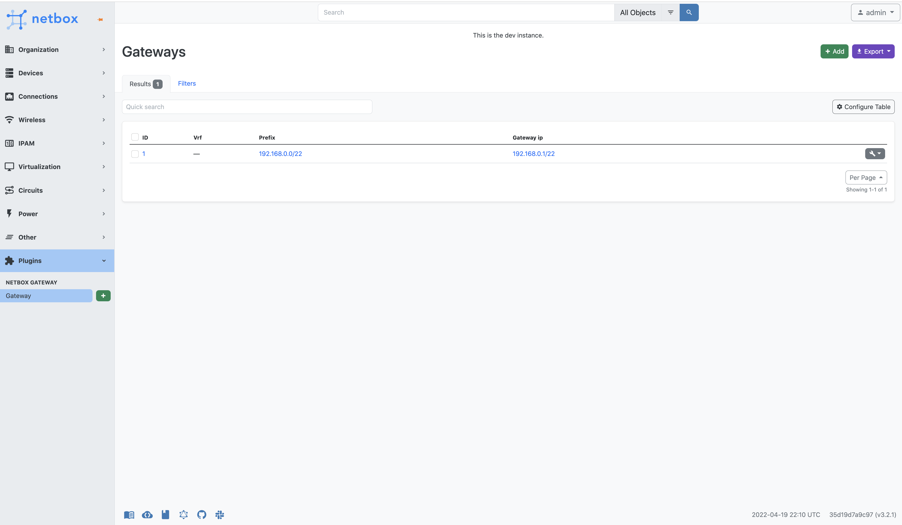

# NetBox Gateways Plugin
[Netbox](https://github.com/netbox-community/netbox) plugin  to Manage simple default gateways for prefixes.

## Compatibility

|      Netbox Version       |   Plugin Version    |
|---------------------------|-------|
| Netbox 4.3                | 0.8.0 |
| Netbox 4.2                | 0.7.0 |
| NetBox 4.1                | 0.6.0 |
| NetBox 4.0                | 0.5.0 |
| NetBox 3.2                | 0.4.2 |

## Installation

1. The plugin is available as a Python package in pypi and can be installed with pip  

```
pip install netbox-gateways
```
2. Enable the plugin in /opt/netbox/netbox/netbox/configuration.py:
```
PLUGINS = ['netbox_gateways']
```

3. Add `netbox-gateways` to your local_requirements.txt to ensure plugin is re-installed during a future upgrade or execution of .upgrade.sh script

```
echo netbox-gateways >> /opt/netbox/local_requirements.txt
```

4. Run Migrate

```
python3 netbox/manage.py migrate
```

## Screenshots

Prefix View


Gateways


Add New Gateway


